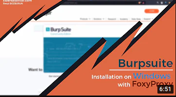
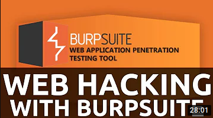
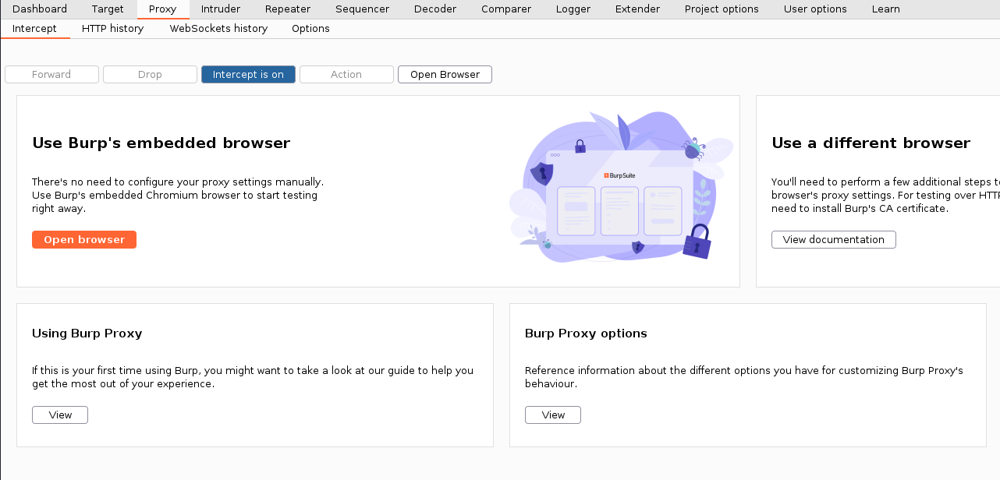
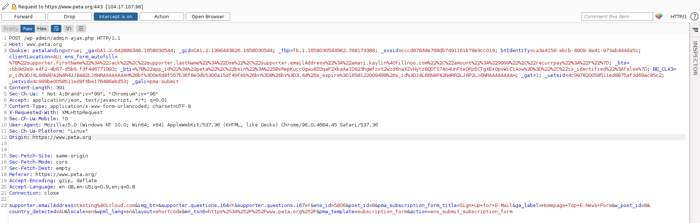
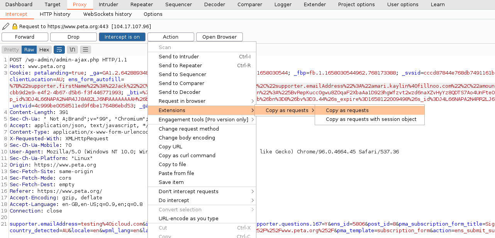

# WORK IN PROGRESS

## info
The easiest way to add websites to this repo is by using Burp Suite. If you would like to do it another way, you do you.

## Burpsuite

1. Install Burpsuite

2. Install "Copy As Python-Requests"

You can find info at [portswigger](https://portswigger.net/support/how-to-install-an-extension-in-burp-suite)
to install [Copy As Python-Requests](b324647b6efa4b6a8f346389730df160).

3. Open Internal Browser

Open the embedded browser in the proxy tab.

4. Find a newsletter

Find a newsletter and capture the request

5. See the methods it uses

If the newsletter requires the use of cookies or captcha's, it will not work. You can edit out the cookies either in proxy or you can send the request to repeater.

6. Copy to python

Copy the request to python.

7. Adding to the script 

Use the scripts in handler as a template for you to base your script off.

8. Send a pull request

Send a pull request and I will check it out.
